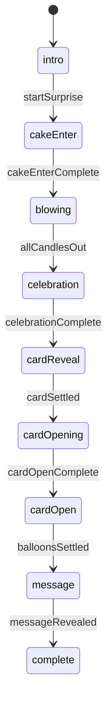
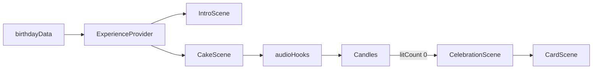

# Sendiment V1 — Technical Specification

## 1. Executive Summary

Sendiment V1 is a **single-page, stateless, hard-coded birthday surprise** whose sole purpose is to prove the core emotional experience works before any platform features exist. The existing POC at [`/Users/pravunathsingh/projects/sendiment-v1`](/Users/pravunathsingh/projects/sendiment-v1) already validates the hardest interaction risk — **microphone blow detection** — via a mature [`src/audio/`](/Users/pravunathsingh/projects/sendiment-v1/src/audio/) module wired into placeholder cake UI.

V1 will wrap that interaction inside a **continuous animated journey**: Intro → Cake → Celebration → 3D Card Reveal → Card Open → Balloons + Message. One primary animation library (**Motion**), one confetti library (**canvas-confetti**), **CSS/SVG** for cake/candles/flames/smoke/balloons, **CSS 3D + Motion** for the card, and **no WebGL, no GSAP, no sound**.

**Confirmed product decisions (from stakeholder):**

- **No audio** — visual-only experience (no SFX, no music)
- **Microphone permission on intro CTA** — requested when user taps "Start the Surprise" (single user gesture)
- **Blow fallback** — tap-and-hold anywhere on cake zone (simulated blow); tap individual candle for accessibility
- **Candles per blow** — **3–4 candles** per detected blow (avoids tedious continuous blowing)
- **Candle display** — tiered age strategy (mini candles + numeric age topper), not one large candle per year for ages 13+
- **Hard-coded demo data** — placeholder name/age/message in `birthdayData.ts` (editable manually before ship)
- **Card replay** — optional replay control to re-watch card open/close animation after message is shown

**Recommended stack additions:** `motion` (~tree-shakable), `canvas-confetti` (zero deps, ~6KB gzipped). Keep React 19, Vite 8, Tailwind 4.

---

## 2. Existing POC Analysis

### What exists today

| Area                    | Status                   | Notes                                                                                                              |
| ----------------------- | ------------------------ | ------------------------------------------------------------------------------------------------------------------ |
| Framework               | React 19 + Vite 8 + TS 6 | React Compiler enabled                                                                                             |
| Styling                 | Tailwind CSS v4          | CSS-first, no config file                                                                                          |
| Routing                 | None                     | Single view [`App.tsx`](/Users/pravunathsingh/projects/sendiment-v1/src/App.tsx)                                   |
| Cake UI                 | Placeholder              | Indigo box + yellow bars                                                                                           |
| Candle logic            | Functional               | [`Candles.tsx`](/Users/pravunathsingh/projects/sendiment-v1/src/cake/Candles.tsx) — state, ref API, click fallback |
| Blow detection          | Production-quality       | Full pipeline in [`src/audio/`](/Users/pravunathsingh/projects/sendiment-v1/src/audio/)                            |
| Card / intro / confetti | Missing                  | [`docs/phase1.md`](/Users/pravunathsingh/projects/sendiment-v1/docs/phase1.md) lists card as next step             |
| Animation libs          | None                     | Only Tailwind `transition-[width]` on volume bar                                                                   |
| Assets                  | Template only            | No cake/card art, no custom fonts                                                                                  |

### Reuse directly (minimal changes)

- **`MicrophoneCapture`**, **`BlowDetector`**, **`useMicrophoneVolume`**, **`useBlowDetector`**, **`MediaAudioError`**, **`volumeAnalyser`**
- **`CandlesHandle`** imperative API: extend to `blowOutNextNCandles(n)`, `litCount` (replacing single-candle-only API)
- Integration pattern: intro CTA → mic request + `START_EXPERIENCE` → volume → blow (3–4 candles) → extinguish

### Refactor/replace

- Placeholder cake/candle visuals → CSS/SVG components inspired by CodePen reference
- `App.tsx` (`Home`) → `BirthdayExperience` orchestrator
- Hard-coded `26` in POC → driven by `birthdayData.age` via `useCandleLayout` tiered strategy
- Extinguished candles currently `hidden` → show unlit wax + smoke animation
- Dev-facing mic toggle UI → production `BlowInteraction` (mic primary + tap-hold fallback, no debug volume bar)

### Technical debt to address in V1

- Rename `App.tsx` export to match purpose
- Centralize `birthdayData` config object
- Add `isMediaDevicesSupported()` pre-flight in cake interaction UI
- Auto-stop mic when all candles out + on stage transition
- No tests today — add manual QA checklist only (no automated test scope unless requested)

---

## 3. Reference Analysis

### 3.1 CodePen Cake ([fazlurr/gPMJMK](https://codepen.io/fazlurr/pen/gPMJMK))

**What it is:** Pure CSS birthday cake (forked from WithAnEs) with layered cake tiers, a single centered candle, and a glowing flame using `box-shadow` + `@keyframes flicker` (skew + shadow intensity oscillation).

**Borrow:**

- Visual language: deep red candle wax (`#7B020B`), rounded candle body, elliptical wax top cap
- Flame shape via asymmetric `border-radius` + orange glow layers
- Flicker via `transform: skewX()` + animated `box-shadow` — cheap, GPU-friendly, believable at small sizes
- Cake tier construction using stacked pseudo-elements / div layers with subtle color variation
- Transform-origin on flame at base (`50% 90%`) for future blow-bend animation

**Do NOT borrow:**

- Single-candle-only layout without adaptation
- SCSS nesting syntax directly (translate to Tailwind + small CSS module or `@layer` rules)
- Literal copy of markup/class names (license OK but recreate in React components)
- Assumption that blow interaction is built-in (CodePen is visual-only; community projects add mic separately)

**V1 approach:** Recreate cake/candle/flame as React components using **CSS keyframes for idle flicker** + **Motion for blow-reactive stretch/extinguish**. Use **tiered candle layout** (`useCandleLayout`) — mini candles in rows + numeric **AgeTopper** for ages 13+.

### 3.2 Mewtru ([mewtru.net](https://www.mewtru.net/))

**What it is:** A card _generator_ landing page (form → link), not the recipient experience itself. Marketing page emphasizes ease, mobile, shareability.

**Borrow (UX principles only):**

- Immediate emotional framing — recipient should feel "something special was made for me"
- Minimal cognitive load — one primary action at a time
- Mobile-first responsive behavior
- Warm birthday visual language (soft colors, celebratory but not cluttered)
- Surprise/reveal pacing — don't show the message too early

**Do NOT borrow:**

- Card creation form, link generation, message picker UI
- SEO/marketing page structure
- Multi-card / multi-language platform patterns

---

## 4. V1 Experience Definition

### Hard-coded data (placeholder — edit manually before ship)

```ts
// src/data/birthdayData.ts
export const birthdayData = {
  recipientName: 'Friend',
  age: 26,
  message:
    'Happy birthday! Wishing you a wonderful day filled with joy and celebration.',
} as const;
```

All scenes read from this single object. Change name, age, and message here only — no scattered JSX copy.

### Stage flow (single continuous experience)



**User-visible narrative:**

1. **Intro** — "Someone made something special for you…" + CTA "Start the Surprise" (requests mic permission on tap)
2. **Cake enter** — Cake layers and candles animate in (scripted, ~1.4s)
3. **Blowing** — User blows (mic) or tap-holds on cake; each blow extinguishes **3–4 candles**; cinematic auto-finish for last few if needed
4. **Celebration** — Confetti burst + sparkles + brief glow; cake fades back
5. **Card reveal** — Closed card flies/settles into center
6. **Card opening** — Card opens on Y-axis hinge
7. **Card open** — Balloons float in; message area ready
8. **Message** — Recipient name → "Happy Birthday" → message; **card replay** control available

**Interaction lock policy:** During scripted transitions (`cake-enter`, `celebration`, `card-reveal`, `card-opening`), block new interactions. During `blowing`, accept blow/tap-hold input. During `message`/`complete`, allow **card open/close replay** only (not full experience restart). Reduced-motion path provides faster/simpler transitions.

---

## 5. Experience State Machine

### Primary stage enum (granular but simple reducer)

More stages than a minimal enum, but still **one `stage` value** — no boolean sprawl. Sub-states (mic status, per-candle state) stay component-local.

```ts
export type ExperienceStage =
  | 'intro'
  | 'cake-enter' // scripted cake entrance animation
  | 'blowing' // interactive candle phase
  | 'celebration' // confetti + pause
  | 'card-reveal' // card flies in closed
  | 'card-opening' // card 3D open animation
  | 'card-open' // card fully open, balloons enter
  | 'message' // text reveal + card replay available
  | 'complete'; // terminal rest state
```

### Component-local sub-state (not global stages)

```ts
export type MicStatus =
  | 'idle'
  | 'starting'
  | 'active'
  | 'denied'
  | 'unsupported';
export type InteractionMode = 'microphone' | 'tap-hold'; // auto-set on permission result

export type BlowProgression = {
  litCount: number;
  totalBlowableCandles: number;
  autoFinishing: boolean;
};
```

### Why this shape

- **Granular stages** map 1:1 to animation scripts and `onAnimationComplete` dispatchers
- **Simple reducer** — invalid transitions are ignored; no nested state machines
- Cake mic mode, calibration, and candle `lit|extinguishing|out` never pollute root stage

### Transition table

| From           | Event                                      | To             |
| -------------- | ------------------------------------------ | -------------- |
| `intro`        | `START_EXPERIENCE` (CTA tap + mic request) | `cake-enter`   |
| `cake-enter`   | `CAKE_ENTER_COMPLETE`                      | `blowing`      |
| `blowing`      | `ALL_CANDLES_OUT`                          | `celebration`  |
| `celebration`  | `CELEBRATION_COMPLETE`                     | `card-reveal`  |
| `card-reveal`  | `CARD_SETTLED`                             | `card-opening` |
| `card-opening` | `CARD_OPEN_COMPLETE`                       | `card-open`    |
| `card-open`    | `BALLOONS_SETTLED`                         | `message`      |
| `message`      | `MESSAGE_REVEAL_COMPLETE`                  | `complete`     |

**Card replay (local, does not change global stage):** From `message` or `complete`, user can trigger `REPLAY_CARD` → temporarily animate card close → open again; `stage` stays `message`/`complete`.

### Orchestration implementation

- **`useReducer`** at `BirthdayExperience` root with transition table above
- **`ExperienceProvider`** context: `{ stage, dispatch, birthdayData }`
- Stage components dispatch completion actions; **`AnimatePresence`** groups scenes by stage cluster
- **`MotionConfig reducedMotion="user"`** at app root

### Age → candle representation (tiered strategy)

**Decision:** Do **not** render 26–27 large individual candles on mobile. Use **visual tiering** with a manageable **blowable candle count**.

| Age range | Visual display                                                  | Blowable candles    |
| --------- | --------------------------------------------------------------- | ------------------- |
| 1–9       | One mini candle per year, centered row                          | Same as age         |
| 10–12     | Two rows, smaller candles                                       | Same as age         |
| 13–20     | ~12 mini candles in staggered rows + numeric age plaque         | **12** mini candles |
| 21–30     | ~12 mini candles in arc + illuminated **AgeTopper** (e.g. "26") | **12** mini candles |
| 31+       | 5–7 decorative minis + prominent numeric age on cake            | **5–7** minis       |

**Default placeholder age 26:** **12 mini blowable candles** + **"26" AgeTopper** (topper is decorative/lit but not counted in blow progression).

**Blow pacing:** With **12 blowable candles** and **3–4 per blow**, user completes in **~3–4 blows** (~2–5 seconds of interaction). If placeholder age is lowered to 1–12 tier, same 3–4-per-blow rule applies via `blowOutNextNCandles`.

**Rationale:** Literal 26–27 full-size candles (~500px+ width) breaks mobile layout; tiered display preserves age meaning while keeping blow count reasonable.

---

## 6. Animation Architecture

### Principles

- **Transform + opacity only** for performance (plus `box-shadow` on flames sparingly)
- **One orchestrator timeline per stage** defined in [`src/experience/timelines.ts`](/Users/pravunathsingh/projects/sendiment-v1/src/experience/timelines.ts)
- **Motion** for scene transitions, card 3D rotation, staggered text, balloon float
- **CSS `@keyframes`** for infinite flame flicker (cheaper than JS loop)
- **canvas-confetti** isolated to celebration (dynamic import)
- **`MotionConfig reducedMotion="user"`** at app root

### Layer stack (z-index)

```
z-0  Background gradient + particles
z-10 Scene content (cake / card)
z-20 Foreground decorations (balloons partial overlap)
z-30 Confetti canvas (pointer-events: none)
z-40 Intro CTA / interaction prompts
```

---

## 7. Technology Research

### 7.1 Motion

**Package:** `motion` / `motion/react` (formerly Framer Motion). Active development (v13+ in 2026), React-first declarative API, WAAPI hybrid engine, tree-shakable.

**V1 usage:**

- Scene enter/exit (`AnimatePresence`)
- Card 3D `rotateY` with spring easing
- Staggered message reveal (`staggerChildren`)
- Balloon floating (`y` oscillation + slight `rotate`)
- CTA hover/tap (`whileHover`, `whileTap`)
- `useReducedMotion()` for alternate timelines

**Reduced motion:** `MotionConfig reducedMotion="user"` disables transform/layout animations globally; pair with custom shorter opacity-only timelines for card/message.

### 7.2 Confetti

| Library               | Bundle           | Deps      | React fit                  | Reduced motion                   | Maint.             | Verdict                    |
| --------------------- | ---------------- | --------- | -------------------------- | -------------------------------- | ------------------ | -------------------------- |
| **canvas-confetti**   | ~6KB gz          | 0         | Direct call / thin wrapper | `disableForReducedMotion` opt-in | Very active, 8M/wk | **Recommended**            |
| react-canvas-confetti | wrapper overhead | 1         | Component API              | inherits confetti opt            | Moderate           | Skip — unnecessary wrapper |
| tsparticles           | 20–100KB+        | many      | Heavy config               | supported                        | Active             | Overkill                   |
| party.js              | ~medium          | DOM-based | Different model            | manual                           | Less common        | Skip                       |

**Decision:** `canvas-confetti` dynamically imported in `CelebrationScene`. Set `disableForReducedMotion: true`. For reduced motion users, show brief gold opacity pulse instead.

### 7.3 Candle Detection

**Existing POC approach (extend, don't rewrite):**

- `getUserMedia({ audio })` on **intro CTA tap** (same gesture as `START_EXPERIENCE`)
- `AnalyserNode` + time-domain RMS
- Ambient calibration (60 frames ~1s) + dynamic threshold + 400ms cooldown between blow events
- **Each blow extinguishes 3–4 candles** via new `blowOutNextNCandles(n)` API

**Browser support:** Chrome/Edge/Firefox/Safari (iOS 14.5+) on HTTPS/localhost. No recording/upload — local analysis only.

**Reliability:** Blow **event** detection is reliable; spatial candle targeting is not — always extinguishes next N lit candles in layout order.

**V1 interaction model (confirmed):**

| Mode                     | Trigger                                            | Behavior                                                                      |
| ------------------------ | -------------------------------------------------- | ----------------------------------------------------------------------------- |
| **Microphone (default)** | Blow detected after calibration                    | Extinguish **3–4 candles** per blow (volume maps to 3 vs 4)                   |
| **Tap-hold fallback**    | Permission denied / unsupported / weak blows       | Press-and-hold anywhere on cake zone; **3–4 candles per 400ms** while holding |
| **Tap single candle**    | Accessibility secondary                            | Extinguish that one candle via keyboard/tap                                   |
| **Cinematic finish**     | ≤3 candles remain OR 45s elapsed with >3 remaining | Auto-extinguish remainder over ~1.2s staggered                                |

**Permission denied UX:** Silent switch to tap-hold; hint: "Tap and hold to blow" — no error wall, no retry nag.

**Intro CTA copy:** "We'll listen for you blowing — nothing is recorded." Permission prompt appears on same tap as starting the experience.

### 7.4 Candle Animation

**Technique:** CSS flicker + Motion extinguish sequence per candle

**Sequence (~600ms):**

1. 0–120ms: flame `skewX` + `scaleY` stretch toward blow direction (Motion)
2. 120–200ms: flame opacity → 0, glow collapse
3. 200–500ms: smoke plume (small `div` or SVG ellipse, opacity + blur + rise)
4. 500–600ms: smoke fade; wick char point visible; candle remains as unlit wax

**Why not Lottie/WebGL:** Up to ~12 blowable candles — DOM + CSS/Motion is sufficient and easier to tune.

### 7.5 3D Card

| Approach            | Quality                | Complexity | Mobile GPU     | Verdict         |
| ------------------- | ---------------------- | ---------- | -------------- | --------------- |
| **CSS 3D + Motion** | High for greeting card | Low        | Excellent      | **Recommended** |
| React Three Fiber   | Very high              | High       | Moderate/heavy | Reject for V1   |
| Hybrid CSS + Motion | High                   | Low-medium | Excellent      | **Selected**    |

**CSS 3D structure:**

```
.card-scene (perspective: 1000px)
  └── .card (transform-style: preserve-3d; rotateY animated)
       ├── .card-cover (backface-visibility: hidden)
       └── .card-inside (rotateY(180deg); backface hidden)
```

**Card open:** Motion animates `.card` from `rotateY(-12deg)` idle → `rotateY(-160deg)` (slight over-rotate) → settle `-150deg` for readable interior. Use `transform-origin: left center` for hinge on left edge.

**Physical feel:** paper texture via subtle CSS noise gradient; inset shadows; 1px highlight edge; soft drop shadow beneath card.

### 7.6 Balloons

**Decision:** **CSS radial-gradient spheres** + elliptical highlight pseudo-element + thin string (`linear-gradient` line) + Motion floating.

**Count:** 5 balloons, primarily left of card, varying sizes (48–80px), colors from palette (coral, gold, sky, lavender, mint).

**Depth:** `translateZ` not required — simulate with scale, blur, opacity, and z-index layering.

**Why not Three.js:** Balloons are decorative; CSS achieves "3D-looking" at lower cost.

### 7.7 Message Reveal

**Decision:** **Staggered fade + upward slide** (NOT typewriter)

```ts
const messageVariants = {
  hidden: { opacity: 0, y: 16 },
  visible: (i: number) => ({
    opacity: 1,
    y: 0,
    transition: { delay: i * 0.12, duration: 0.5, ease: [0.22, 1, 0.36, 1] },
  }),
};
```

**Order:** sparkle dot → recipient name (large script/display) → "Happy Birthday" → message paragraph (single block fade, not word-by-word — avoids gimmick)

---

## 8. Technology Decisions

### Decision format summary

#### UI Framework: **Keep React 19 + Vite 8**

- **Why:** Already established; React Compiler enabled; no migration cost
- **Alternatives:** None justified
- **V1 implications:** Build scenes as React components
- **Future:** Same stack scales to routed card URLs

#### Styling: **Keep Tailwind CSS v4**

- **Why:** Already in use; rapid responsive iteration
- **Add:** Small scoped CSS for flame `@keyframes` and paper texture (either `@layer components` in `index.css` or co-located `.css` per scene)
- **Reject:** shadcn/MUI — unnecessary UI kit weight

#### Animation: **Motion (`motion/react`)**

- **Why:** React-native API, springs, stagger, AnimatePresence, reduced-motion built-in
- **Alternatives rejected:** GSAP (imperative, React friction, license considerations), React Spring (less ergonomic orchestration), raw WAAPI (verbose)
- **Tradeoff:** +~30KB gz depending on imports; mitigated by tree-shaking
- **V1:** Single animation framework only

#### Confetti: **canvas-confetti**

- **Why:** Zero deps, proven, tiny, flexible bursts
- **Reject:** tsparticles (heavy), custom canvas engine (time)

#### Candle rendering: **CSS + AgeTopper + useCandleLayout**

- **Why:** CodePen-quality flames; tiered layout for ages 13+; mobile-safe
- **Reject:** 26–27 full-size literal candles on cake top

#### Blow detection: **Mic on intro CTA + tap-hold fallback + 3–4 candles per blow**

- **Why:** Single gesture starts experience and mic; fallback prevents dead ends; multi-candle blows keep pacing snappy
- **Reject:** Cake-stage mode chooser (superseded), one-candle-per-blow (too tedious even with tiered layout)
- **POC change:** Extend `CandlesHandle` with `blowOutNextNCandles(count: number)`; keep cooldown in `BlowDetector`

#### Card: **CSS 3D + Motion hybrid**

- **Why:** Best quality/complexity ratio for greeting card
- **Reject:** R3F

#### Balloons: **CSS gradients + Motion**

- **Why:** Simple, performant, dimensional enough

#### Sound: **None (confirmed)**

- No SFX, no background music, no mute toggle

#### Card replay: **Open/close animation replay only**

- **Why:** Lets recipient re-watch the card moment without restarting cake/confetti
- **Scope:** Button/link on `message`/`complete` stages — replays card close → open sequence locally; does not reset global stage to `intro`
- **Reject:** Full experience "Play again" (refresh handles that)

---

## 9. Proposed Architecture

```
src/
├── main.tsx
├── App.tsx                          # MotionConfig + BirthdayExperience
├── index.css                        # Tailwind + global keyframes/textures
├── data/
│   └── birthdayData.ts
├── experience/
│   ├── ExperienceProvider.tsx
│   ├── types.ts                     # ExperienceStage, etc.
│   ├── timelines.ts                 # ms constants per stage
│   ├── useExperienceStage.ts
│   └── BirthdayExperience.tsx       # AnimatePresence orchestrator
├── scenes/
│   ├── IntroScene/
│   ├── CakeScene/
│   ├── CelebrationScene/
│   └── CardScene/
├── cake/
│   ├── Cake.tsx
│   ├── CakeLayers.tsx
│   ├── Candles.tsx
│   ├── Candle.tsx
│   ├── Flame.tsx
│   ├── Smoke.tsx
│   ├── AgeTopper.tsx
│   ├── useCandleLayout.ts           # age → positions + blowable count
│   └── cake.css
├── card/
│   ├── BirthdayCard.tsx
│   ├── CardCover.tsx
│   ├── CardInside.tsx
│   ├── BirthdayMessage.tsx
│   ├── CardReplayControl.tsx        # replay open/close only
│   └── card.css
├── interaction/
│   ├── BlowInteraction.tsx          # mic + tap-hold unified overlay
│   └── useBlowInteraction.ts
├── effects/
│   ├── useConfetti.ts
│   └── GlowPulse.tsx
├── decorations/
│   ├── Balloons.tsx
│   ├── Balloon.tsx
│   └── BackgroundParticles.tsx
├── animation/
│   ├── config.ts
│   └── variants.ts
└── audio/                           # keep existing module; extend Candles API
```

**Data flow:**



---

## 10. Component Architecture

```
App
└── MotionConfig (reducedMotion="user")
    └── ExperienceProvider
        └── BirthdayExperience              [useReducer stage machine]
            ├── ExperienceBackground        [gradient + particles — persistent]
            ├── ScreenReaderAnnouncer
            ├── AnimatePresence
            │   ├── IntroScene              [stage === "intro"]
            │   │   ├── IntroCopy
            │   │   └── StartButton         [mic request + START_EXPERIENCE]
            │   │
            │   ├── CakeScene               [stage === "cake-enter" | "blowing"]
            │   │   ├── Cake
            │   │   │   ├── CakeLayers
            │   │   │   ├── AgeTopper
            │   │   │   └── Candles
            │   │   │        └── Candle × N
            │   │   │             ├── Flame
            │   │   │             └── Smoke
            │   │   ├── BlowInteraction     [mic + tap-hold overlay]
            │   │   └── BlowHint            [adaptive hint text]
            │   │
            │   ├── CelebrationScene        [stage === "celebration"]
            │   │   ├── Confetti
            │   │   └── GlowPulse
            │   │
            │   └── CardScene               [stage === "card-reveal" | "card-opening" | "card-open" | "message" | "complete"]
            │        ├── BirthdayCard
            │        │   ├── CardCover
            │        │   └── CardInside
            │        │        └── BirthdayMessage
            │        ├── Balloons
            │        └── CardReplayControl    [message/complete only]
            └── StageDevOverlay (dev only, optional ?dev=1)
```

---

## 11. Animation Timeline

All times are targets for tuning in Phase 9. Reduced-motion variants run at ~40% duration with opacity-only substitutes.

### INTRO (total ~1.4s before CTA idle)

| ms    | Event                                                             |
| ----- | ----------------------------------------------------------------- |
| 0     | Background gradient + particles fade in (600ms)                   |
| 200   | Headline opacity + y: `"Someone made something special for you…"` |
| 500   | Subline (optional soft shimmer line)                              |
| 800   | CTA scale 0.92→1 + glow pulse begins                              |
| 1400+ | Idle: subtle CTA breathing glow                                   |

**CTA tap →** button scale down (0.95), glow burst, **request mic permission**, dispatch `START_EXPERIENCE`, intro fades out (400ms).

### CAKE ENTER (on START_EXPERIENCE, stage `cake-enter`)

| ms   | Event                                                                              |
| ---- | ---------------------------------------------------------------------------------- |
| 0    | Cake container fades in at scale 0.85                                              |
| 300  | Cake layers slide up (spring)                                                      |
| 600  | Mini candles + AgeTopper drop in (stagger 50ms)                                    |
| 900  | Flames ignite (opacity + scale stagger)                                            |
| 1400 | Dispatch `CAKE_ENTER_COMPLETE` → stage `blowing`; show "Blow out the candles" hint |

### BLOWING (interactive, stage `blowing`, ~5–15s user-paced)

| Event                 | Response                                               |
| --------------------- | ------------------------------------------------------ |
| Blow detected (mic)   | Extinguish **3–4 candles** (RMS maps soft→3, strong→4) |
| Tap-hold on cake zone | Extinguish **3–4 candles** every 400ms while held      |
| Single tap on candle  | Extinguish that one candle (a11y)                      |
| ≤3 candles remain     | Cinematic auto-finish over ~1.2s                       |
| All out               | 300ms pause → `ALL_CANDLES_OUT` → `celebration`        |

### CELEBRATION (~1.8s)

| ms   | Event                                                       |
| ---- | ----------------------------------------------------------- |
| 0    | Final smoke puff                                            |
| 150  | Confetti dual burst (center + upper)                        |
| 300  | Screen soft white/gold flash (opacity 0.15)                 |
| 600  | Cake scales to 0.92 + fades to 0.3                          |
| 1200 | Cake exits; dispatch `CELEBRATION_COMPLETE` → `card-reveal` |

### CARD REVEAL (stage `card-reveal`)

| ms   | Event                                              |
| ---- | -------------------------------------------------- |
| 0    | Closed card enters from below (y, rotateX, spring) |
| 800  | Card settles; idle float begins                    |
| 1200 | Dispatch `CARD_SETTLED` → `card-opening`           |

### CARD OPENING (stage `card-opening`)

| ms     | Event                                         |
| ------ | --------------------------------------------- |
| 0–1200 | Card rotateY 0 → -160deg (hinge on left edge) |
| 1200   | Dispatch `CARD_OPEN_COMPLETE` → `card-open`   |

### CARD OPEN + MESSAGE (stages `card-open` → `message` → `complete`)

| ms   | Event                                                                  |
| ---- | ---------------------------------------------------------------------- |
| 0    | Balloons enter from left (stagger 100ms)                               |
| 800  | Dispatch `BALLOONS_SETTLED` → `message`                                |
| 1000 | Recipient name fade-up                                                 |
| 1400 | "Happy Birthday" fade-up                                               |
| 1800 | Message body fade-up                                                   |
| 2400 | Dispatch `MESSAGE_REVEAL_COMPLETE` → `complete`                        |
| ∞    | **CardReplayControl** visible — replays close/open animation on demand |

---

## 12. Responsive Strategy

**Primary target:** Mobile portrait (375–430px width)

| Element          | Mobile portrait           | Mobile landscape | Tablet       | Desktop      |
| ---------------- | ------------------------- | ---------------- | ------------ | ------------ |
| Cake width       | 90vw max 320px            | 60vh constrained | 400px        | 420px        |
| Mini candles     | 8px wide, 2 rows × 6      | compact 2 rows   | 10px, 2 rows | 10px, 2 rows |
| Age topper       | text-4xl centered on cake | text-3xl         | text-5xl     | text-5xl     |
| Card size        | 88vw × 62vw aspect        | max-h 80dvh      | 380px wide   | 400px wide   |
| Blow zone        | full cake hit area ≥ 44px | same             | same         | same         |
| Candles per blow | 3–4 (mic or tap-hold)     | same             | same         | same         |

**Implementation:** Tailwind breakpoints `sm/md/lg` + CSS container queries on `.cake-top` for candle grid (`grid-template-columns: repeat(auto-fit, minmax(12px, 1fr))`).

**Viewport height:** Use `min-h-dvh` and avoid vertical overflow scroll during scenes; scale down cake on short viewports (`max-h-[70dvh]`).

---

## 13. Accessibility

| Requirement    | Implementation                                                                                                       |
| -------------- | -------------------------------------------------------------------------------------------------------------------- |
| Reduced motion | `MotionConfig reducedMotion="user"`; confetti disabled; card open → opacity crossfade; message appears without slide |
| Keyboard       | CTA focusable; Enter/Space starts + triggers mic; tap-hold via pointer events; individual candles focusable          |
| Screen readers | Stage announcements; card replay button labeled "Replay card opening"                                                |
| Mic permission | On intro CTA: "We'll listen for you blowing — nothing is recorded."                                                  |
| Denied mic     | Non-alarming switch to tap-hold; no red error styling                                                                |
| Color          | Text contrast ≥ 4.5:1 on message interior; don't rely on color alone for lit/unlit (lit has flame + glow)            |
| Animations off | Experience remains completable; no trapped states                                                                    |

---

## 14. Performance Strategy

**Targets:**

- LCP < 2.5s on mid-range mobile (no heavy images)
- Animation frame budget: 60fps for transforms; accept 30fps only on confetti peak (~300ms)
- Initial JS bundle excluding confetti: target < 150KB gz (with Motion)

**Tactics:**

- Dynamic `import('canvas-confetti')` on celebration only
- Memoize `Candle` with `React.memo`; stable blow callbacks via refs
- Flame flicker via CSS only (no per-frame React updates)
- Limit confetti particle count on mobile (`particleCount: 80` vs 150 desktop)
- Use `will-change: transform` sparingly on card only during open
- Self-host or use `font-display: swap` if adding 1 display + 1 body Google Font
- No WebGL, no large PNGs — CSS gradients + optional tiny SVG noise tile (<4KB)

**Acceptance:** No visible jank on iPhone 12 / Pixel 6 class devices during card open + message reveal.

---

## 15. Error & Fallback Strategy

| Scenario                     | Behavior                                                     |
| ---------------------------- | ------------------------------------------------------------ |
| Mic permission denied        | Silent switch to tap-hold; hint "Tap and hold to blow"       |
| No mic / unsupported         | Tap-hold from start of `blowing` stage                       |
| Blow too weakly              | Hint after 30s; cinematic auto-finish after 45s if >3 remain |
| Repeated blows               | 400ms cooldown between multi-candle blow events              |
| Card replay during animation | Queue or ignore until current card animation completes       |
| Tap during transition        | Ignored (`pointer-events-none` on locked stages)             |
| Refresh                      | Restart at intro (stateless)                                 |
| AudioContext failure         | Fall back to tap mode with message                           |

---

## 16. Detailed Implementation Plan

### Phase 0 — Repository / POC analysis

**Status:** Complete via this spec. No code changes.

---

### Phase 1 — Research / technical spikes

#### V1-SPIKE-001 — Motion + AnimatePresence scene swap

- **Objective:** Validate intro→cake crossfade with reduced motion
- **Files:** temp spike or `src/experience/BirthdayExperience.tsx`
- **Dependencies:** install `motion`
- **Acceptance:** Scene swap without layout flash; reduced motion skips transform
- **Complexity:** S

#### V1-SPIKE-002 — CSS 3D card open

- **Objective:** Hinge open with left-edge origin feels physical
- **Files:** `src/card/BirthdayCard.tsx`
- **Acceptance:** Cover/back faces correct; no z-fighting; mobile smooth
- **Complexity:** M

#### V1-SPIKE-003 — Candle layout algorithm

- **Objective:** Age → tiered positions + blowable count via `useCandleLayout`
- **Acceptance:** Ages 5, 12, 26, 50 all look good at 375px; age 26 = 12 minis + topper
- **Complexity:** M

#### V1-SPIKE-004 — Confetti lazy-load spike

- **Objective:** Dynamic import + reduced motion guard
- **Files:** `src/effects/useConfetti.ts`
- **Acceptance:** Burst on demand; no SSR issues
- **Complexity:** S

#### V1-SPIKE-005 — Blow interaction integration

- **Objective:** Mic on intro start + tap-hold fallback + 3–4 candles per blow
- **Files:** `src/interaction/BlowInteraction.tsx`
- **Acceptance:** Blow extinguishes 3–4 candles; denial falls back seamlessly
- **Complexity:** M

---

### Phase 2 — Experience foundation

#### V1-FOUND-001 — Birthday data module

- **Objective:** Central config object
- **Files:** `src/data/birthdayData.ts`
- **Acceptance:** All copy reads from single source
- **Complexity:** S

#### V1-FOUND-002 — Experience stage reducer

- **Objective:** `useReducer` with granular stages per §5
- **Files:** `src/experience/useExperienceStage.ts`, `types.ts`
- **Acceptance:** All transitions in table work; invalid transitions ignored
- **Complexity:** M

#### V1-FOUND-003 — Timelines constants

- **Objective:** Named ms durations / stagger values
- **Files:** `src/experience/timelines.ts`
- **Acceptance:** Scenes import constants, not magic numbers
- **Complexity:** S

#### V1-FOUND-004 — BirthdayExperience orchestrator

- **Objective:** AnimatePresence + BackgroundParticles
- **Files:** `src/experience/BirthdayExperience.tsx`, `App.tsx`
- **Acceptance:** Stages render exclusively; background persists
- **Complexity:** M

#### V1-FOUND-005 — Design tokens in CSS

- **Objective:** Palette, fonts, shadows as CSS variables
- **Files:** `src/index.css`
- **Acceptance:** Warm premium palette applied consistently
- **Complexity:** S

---

### Phase 3 — Intro

#### V1-INTRO-001 — Intro layout + gradient background

- **Files:** `src/scenes/IntroScene/IntroScene.tsx`, `BackgroundParticles.tsx`
- **Acceptance:** Full viewport; mobile-first; subtle motion
- **Complexity:** M

#### V1-INTRO-002 — StartButton with mic + start

- **Objective:** Hover/tap glow; on tap: request mic, dispatch `START_EXPERIENCE`
- **Acceptance:** Single gesture starts experience and mic; keyboard Enter works
- **Complexity:** M

#### V1-INTRO-003 — Intro entry timeline

- **Objective:** Stagger headline + CTA per §11
- **Acceptance:** Matches timeline ±100ms
- **Complexity:** S

---

### Phase 4 — Cake

#### V1-CAKE-001 — CakeLayers component

- **Files:** `src/cake/CakeLayers.tsx`, `cake.css`
- **Acceptance:** CodePen-quality tiers, icing, drips; responsive scale
- **Complexity:** L

#### V1-CAKE-002 — AgeTopper + useCandleLayout

- **Files:** `src/cake/AgeTopper.tsx`, `useCandleLayout.ts`
- **Acceptance:** Tiered layout per §5; placeholder age 26 shows "26" + 12 minis
- **Complexity:** M

#### V1-CAKE-003 — Candle, Flame, Smoke components

- **Acceptance:** CSS flicker idle; Motion extinguish sequence; unlit wax visible
- **Complexity:** M

#### V1-CAKE-004 — Candles container + blowOutNextNCandles

- **Files:** `src/cake/Candles.tsx`
- **Acceptance:** API extinguishes 1–4 candles per call; staggered smoke per candle
- **Complexity:** M

#### V1-CAKE-005 — BlowInteraction (mic + tap-hold)

- **Files:** `src/interaction/BlowInteraction.tsx`, `useBlowInteraction.ts`
- **Acceptance:** 3–4 per blow (mic); tap-hold 3–4 per 400ms; pointer events on cake zone
- **Complexity:** L

#### V1-CAKE-006 — CakeScene entry + blowing stages

- **Files:** `src/scenes/CakeScene/CakeScene.tsx`
- **Acceptance:** `cake-enter` → `blowing` dispatch; hint text adapts to interaction mode
- **Complexity:** M

#### V1-CAKE-007 — Cinematic auto-finish

- **Acceptance:** ≤3 remain or 45s timeout → auto-extinguish; never trapped
- **Complexity:** M

---

### Phase 5 — Celebration

#### V1-CELEB-001 — Confetti wrapper

- **Files:** `src/celebration/confetti.ts`
- **Acceptance:** Dual burst; `disableForReducedMotion: true`
- **Complexity:** S

#### V1-CELEB-002 — CelebrationScene

- **Files:** `src/scenes/CelebrationScene/CelebrationScene.tsx`
- **Acceptance:** Triggers confetti; cake fade; calls `onStageComplete`
- **Complexity:** M

#### V1-CELEB-003 — Sparkle overlay

- **Acceptance:** Brief gold flash + CSS sparkles; reduced motion = flash only
- **Complexity:** S

---

### Phase 6 — Card

#### V1-CARD-001 — Card structure (cover + inside)

- **Files:** `src/card/BirthdayCard.tsx`, `CardCover.tsx`, `CardInside.tsx`, `card.css`
- **Acceptance:** Physical paper look; correct backface handling
- **Complexity:** M

#### V1-CARD-002 — Card reveal entrance

- **Files:** `src/scenes/CardScene/CardScene.tsx`
- **Acceptance:** Closed card enters per timeline
- **Complexity:** M

#### V1-CARD-003 — Card open animation

- **Acceptance:** Smooth hinge open; readable interior at rest
- **Complexity:** M

---

### Phase 7 — Balloons

#### V1-BALLOON-001 — Balloon component

- **Files:** `src/decorations/Balloon.tsx`
- **Acceptance:** Gradient sphere + highlight + string
- **Complexity:** S

#### V1-BALLOON-002 — Balloons group layout

- **Files:** `src/decorations/Balloons.tsx`
- **Acceptance:** Left-weighted; varied sizes; subtle float loop
- **Complexity:** M

#### V1-CARD-004 — CardReplayControl

- **Files:** `src/card/CardReplayControl.tsx`
- **Objective:** Replay card close → open animation without resetting experience stage
- **Acceptance:** Visible on `message`/`complete`; accessible button; reduced motion = instant open
- **Complexity:** M

---

### Phase 8 — Message

#### V1-MSG-001 — BirthdayMessage stagger reveal

- **Files:** `src/scenes/CardScene/BirthdayMessage.tsx`
- **Acceptance:** Name → heading → message; elegant easing
- **Complexity:** M

#### V1-MSG-002 — aria-live stage announcements

- **Acceptance:** Screen reader gets stage + recipient context
- **Complexity:** S

---

### Phase 9 — Polish

#### V1-POLISH-001 — Global easing/timing pass

- **Complexity:** M

#### V1-POLISH-002 — Shadow/gradient micro-polish

- **Complexity:** S

#### V1-POLISH-003 — Responsive QA fixes

- **Complexity:** M

---

### Phase 10 — Accessibility / fallback

#### V1-A11Y-001 — Reduced motion paths all stages

- **Complexity:** M

#### V1-A11Y-002 — Mic/tap-hold fallback matrix tested

- **Cases:** mic granted, denied, unsupported, tap-hold, single-candle tap, 3–4 per blow pacing
- **Complexity:** M

#### V1-A11Y-003 — Keyboard navigation audit

- **Complexity:** S

---

### Phase 11 — Performance

#### V1-PERF-001 — Bundle analysis (`vite build --analyze` or rollup visualizer)

- **Complexity:** S

#### V1-PERF-002 — Mobile animation profiling

- **Complexity:** M

---

### Phase 12 — QA

#### V1-QA-001 — Manual test matrix

- Desktop: Chrome, Safari, Firefox
- Mobile: iOS Safari, Android Chrome
- Cases: mic granted/denied, tap only, reduced motion, short viewport, refresh
- **Complexity:** M

---

## Technology Comparison Table

| Technology         | Purpose                 | Advantages                           | Disadvantages               | V1 Recommendation |
| ------------------ | ----------------------- | ------------------------------------ | --------------------------- | ----------------- |
| **Motion**         | Scene + UI animation    | React-native, stagger, springs, a11y | Bundle size                 | **Primary**       |
| GSAP               | Timeline animation      | Powerful sequencing                  | React integration friction  | Skip              |
| CSS animations     | Flame flicker, textures | Zero JS cost                         | Hard orchestration          | **Supplement**    |
| Web Animations API | Low-level               | Browser-native                       | Verbose in React            | Skip              |
| React Spring       | Physics UI              | Good springs                         | Less presence orchestration | Skip              |
| Lottie             | Vector animations       | Designer-friendly                    | Asset pipeline, weight      | Skip              |
| canvas-confetti    | Celebration             | Tiny, proven                         | Canvas only                 | **Use**           |
| Three.js / R3F     | 3D card/balloons        | Max 3D fidelity                      | Heavy, overkill             | Skip              |
| CSS 3D             | Card flip               | Lightweight, convincing              | Limited lighting            | **Use**           |

---

## 17. V1 Definition of Done

- [ ] Opens directly into intro (no auth, no forms)
- [ ] Intro CTA requests mic + starts experience in one gesture
- [ ] Cake uses **tiered candle layout** + **AgeTopper** for placeholder age
- [ ] Each blow extinguishes **3–4 candles** (mic or tap-hold fallback)
- [ ] Tap-hold fallback works when mic denied/unsupported
- [ ] Cinematic auto-finish prevents infinite trap
- [ ] Confetti celebration impactful; respects reduced motion
- [ ] CSS 3D card reveal + open smooth on mobile
- [ ] Balloons dimensional, left-weighted, subtly floating
- [ ] Message reveals in correct sequence from `birthdayData`
- [ ] **Card open/close replay** works after message shown
- [ ] **No sound** anywhere in the experience
- [ ] Entire flow feels continuous (shared background)
- [ ] Excellent mobile + desktop experience
- [ ] Reduced-motion path exists
- [ ] No backend, DB, auth, or platform features
- [ ] `birthdayData.ts` is single content source (placeholder values OK)

---

## 18. Explicit Out-of-Scope

**NOT to be implemented in V1:**

Authentication, login, signup, user accounts, user profiles, database, backend, API, user library, card history, card management, card editor, dynamic card creation, unique URLs, sharing, WhatsApp/email integration, payments, subscriptions, analytics, admin dashboard, CMS, notifications, email reminders, birthday tracking, multiple cards, multi-user support, **sound/music/SFX**, **full experience replay** (refresh restarts entire flow), skip animations button, automated test suite (unless separately requested).

**In scope (clarification):** Card **open/close animation replay** only — not a full experience restart.

---

## 19. Open Questions

**Resolved:**

1. Sound/music → **No audio**
2. Mic permission → **On intro CTA** (single gesture with start)
3. Blow fallback → **Tap-and-hold on cake zone**
4. Candles per blow → **3–4**
5. Candle display → **Tiered layout + AgeTopper** (previous plan)
6. State machine → **Granular stages** (`cake-enter`, `blowing`, `card-reveal`, etc.)
7. Placeholder data → **Generic values in `birthdayData.ts`** (edit manually)
8. Card replay → **Yes — open/close animation only**

**Remaining (non-blocking):**

9. **Skip animations?** Default: no skip button; reduced motion only
10. **Minimum browser support?** Default: last 2 versions Chrome/Safari/Firefox; iOS 16+
11. **Display fonts?** Default: Fraunces + DM Sans
12. **Card cover design?** Default: warm cream + gold "Happy Birthday" emboss
13. **Dev stage jumper?** Default: `?dev=1` overlay for QA
14. **Exact placeholder copy?** Current defaults in §4 — change in `birthdayData.ts` before ship
